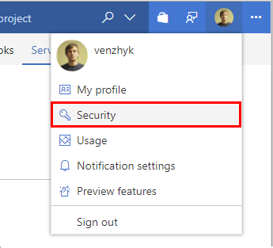
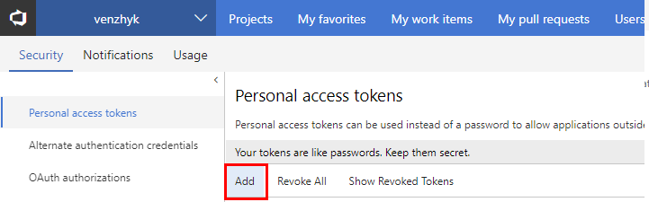
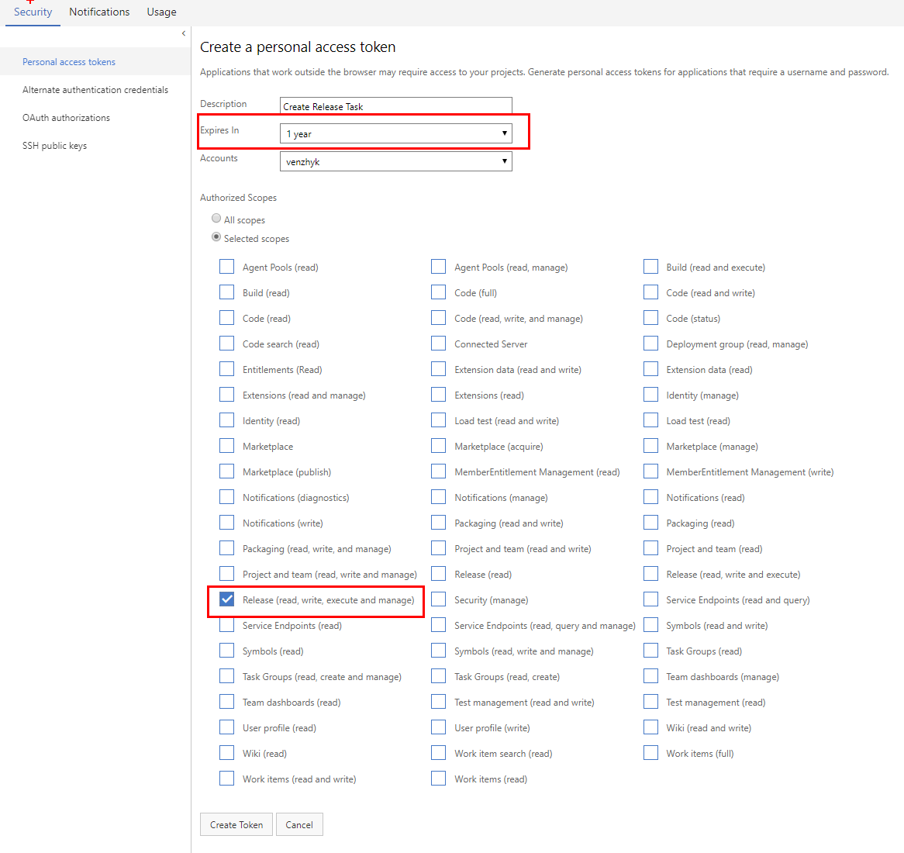
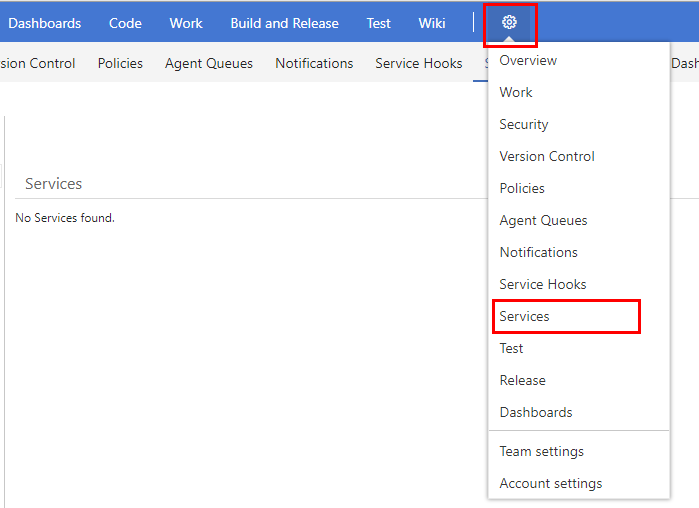
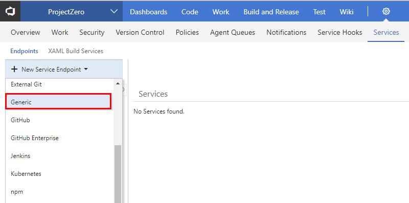
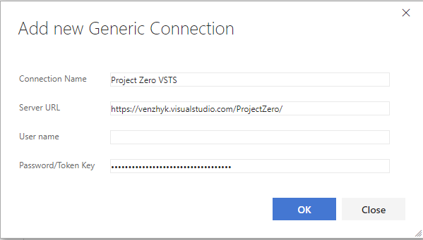

## 1. Go to Account Security Settings and add new AccessToken.

 

`Release (read, write, execute and manage)` scope shold be enough for `Create Release` task.

## 2. Then create new Generic Service Endpoint. 

    * Choose name
    * URL should contain project name and Put Access Token
        http://<vsts-account>.vsrm.visualstudio.com/<project-name>/
        * Do not forget trailing slash '/'!
    * Leave User Name empty
    * Put your new Access Token

