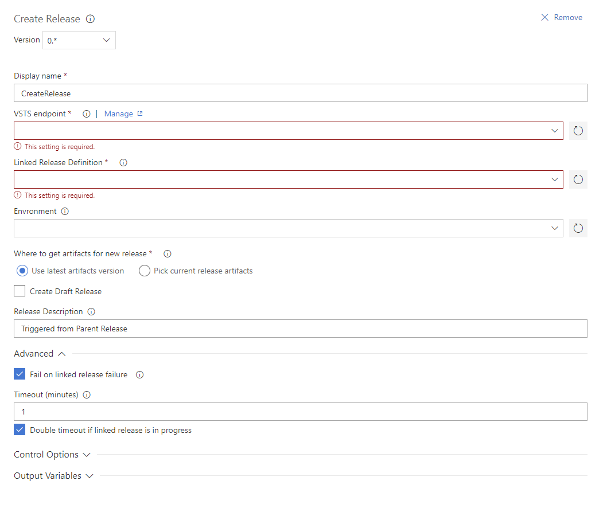

# VSTS Tasks

Repo contains helper tasks for Visual Studio Team Services that I'm using for my work.

# Disclaimer
>**There is no any commitments to support or to enhance current functionality.**
>
>No guarantee that any issue or feature request will be addressed.
>All sources are provided as is.
>
>However, you are welcome to use and copy all source codes.
>Also, you might create a pull-request and it might be accepted.

# Create Release Task

Creates new release as part of current release pipe line.

>This task requires `Generic Service Endpoint` to your project on VSTS service.
>[Step by step instruction here](docs/new-connected-service.md)

## How to install
1. Load source code
2. Open console in root folder
3. Install tfx-cli tool (*npm should be preinstalled on local machine*)

    `> npm i -g tfx-cli`
4. Login to your VSTS account

    `> tfx login`
    * Service URL: `https://<account-name>.visualstudio.com/DefaultCollection`
    * Personal access token: [see instuction how to generate new](/docs/new-connected-service.md)

5. Upload Task to VSTS instance

    `> tfx build tasks upload --task-path .\Tasks\CreateRelease`

6. Open any release definition and add new task to `Agent Phase`

7. Set task options

## Options

0. Select VSTS Service Endpoint
1. Select linked release from drop down menu
2. Choose which environment should be trigered
    * Environment should be setup for automatic start
    * All other environments autostart will be suppressed 
3. Choose where to get artifacts for linked release
    * Task can reuse artifacts from current release
    * Or, use latest available artifacts from linked release
4. Task can create a draft release
5. Add any suffix to linked release description
6. Choose if you want to wait until linked release finish
    * Current release will fail if child release is failed or canceled
    * Just triger child release and successfully finish current task
7. Set timeout, after which child release will be treated as failed

